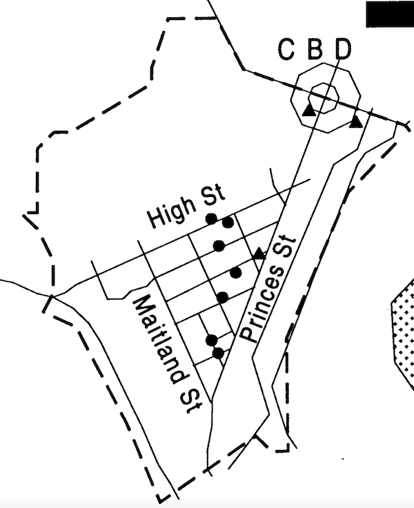

#### Triangle zine project

This is a personal project to finish a creative zine about a cherished if quite 'derro' (Dunedin slang for "derelict") neighborhood in Dunedin, New Zealand. 

I collaborated with a number of others on work towards this project who have contributed a variety of items in different mediums including:
 * 24 Photographs by Ted Whittaker 

... Full credits where due and production values to follow.

This project aims to incorporate some better-design practices to display and interact with a variety of content as a 'general catch all' of my front-end knowledge.

##### Quick start

1. Clone the repository
2. Launch `index.html`

##### Current production

`v0.1` First major push is a working and responsive image slideshow gallery with some basic style elements. It uses Javascript string variables to target the thumbnails and bring the selected thumbnail into focus into the main image container.
`v0.2` Deployed to Firebase at rapid speed at `https://triangle-zine.firebaseapp.com`

NB: Currently only stand alone Jasmine tests work via `SpecRunner.html`. Actual node implementation of jasmine tests to follow.

##### Technologies used

* HTML5
* CSS3
* Javascript
* Jasmine - JS Testingg